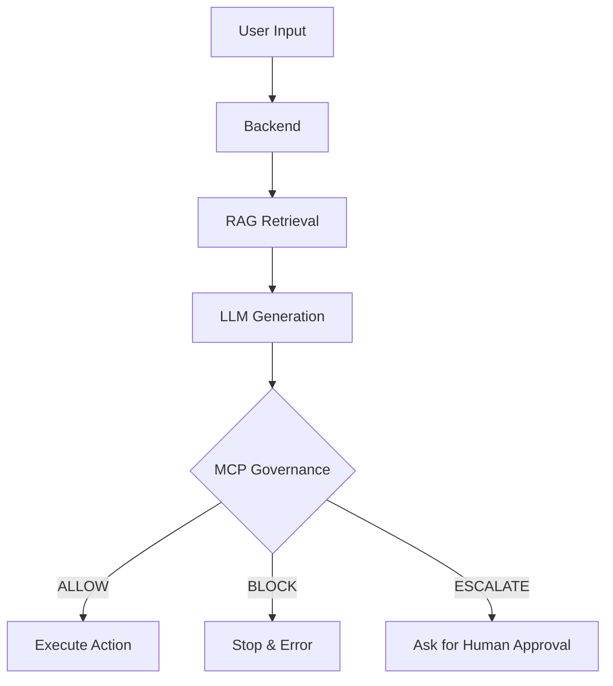

# AI Architecture Guide (For Interns)

Welcome to the team! Since you are working on the AI side of Auromind, you need to understand **how our system thinks**.

We do **not** just send user messages to ChatGPT. That is unsafe and useless for business.
Instead, we use a **Governed Architecture**.

---

## 1. The Core Concept: "The Brain & The Police"

Imagine our AI has two bosses:
1.  **The Brain (RAG):** Gives it knowledge it doesn't have.
2.  **The Police (MCP):** Stops it from doing stupid or dangerous things.

### The Flow


---

## 2. MCP (Model Context Protocol)
**Location:** `backend/app/services/mcp_service.py`

This is the most important part of our system. It is a "Safety Layer".
Before the AI sends an email, posts an ad, or replies to a customer, the MCP checks the **Intent**.

**How it works:**
1.  **Input:** AI says "I want to send a refund email."
2.  **Rules:** We have a list of rules (e.g., "Refunds over $50 need human approval").
3.  **Decision:**
    *   **ALLOW:** Safe. Do it.
    *   **BLOCK:** Dangerous (e.g., "I hate you"). Stop it.
    *   **ESCALATE:** Risky. Ask the boss (User) for permission.

**Your Job as AI Engineer:**
*   You will write new **Rules**.
*   You will tune the **Confidence Thresholds** (e.g., if AI is only 50% sure, force it to ask a human).

---

## 3. RAG (Retrieval Augmented Generation) / "The Brain"
**Location:** `backend/app/services/rag_service.py`

Standard AI (Gemini/OpenAI) knows about the world, but it knows **nothing** about our specific client's business.
RAG fixes this.

**How it works:**
1.  **Ingest:** User uploads a PDF or Website.
2.  **Embed:** We turn that text into "Numbers" (Vectors) and save it in a database (`ChromaDB` or `PGVector`).
3.  **Retrieve:** When a user asks "What is your pricing?", we look up the "Pricing" vector.
4.  **Generate:** We mistakenly tell the AI: *"Here is the pricing info. Now answer the user."*

**Your Job as AI Engineer:**
*   Improve how we chunk/split the text.
*   Make the search results more relevant.

---

## 4. Folder Structure (Where is the code?)

*   **`backend/app/routers/mcp.py`** -> The API Endpoints for the safety system.
*   **`backend/app/services/mcp_service.py`** -> The Logic for the safety system (Rules live here).
*   **`backend/app/services/rag_service.py`** -> The Search Engine logic.
*   **`backend/app/services/embedding_service.py`** -> Converts text to numbers.

## 5. How to Start Coding

1.  **Clone the Repo:**
    ```bash
    git clone https://github.com/Auromind-Ai/Auromindai-Base-MVP.git
    cd Auromindai-Base-MVP
    ```

2.  **Setup Backend:**
    ```bash
    cd backend
    pip install -r requirements.txt
    uvicorn app.main:app --reload
    ```

3.  **Test It:**
    Go to `http://localhost:8000/docs`.
    Try the `/mcp/evaluate` endpoint to see how the "Police" works.
